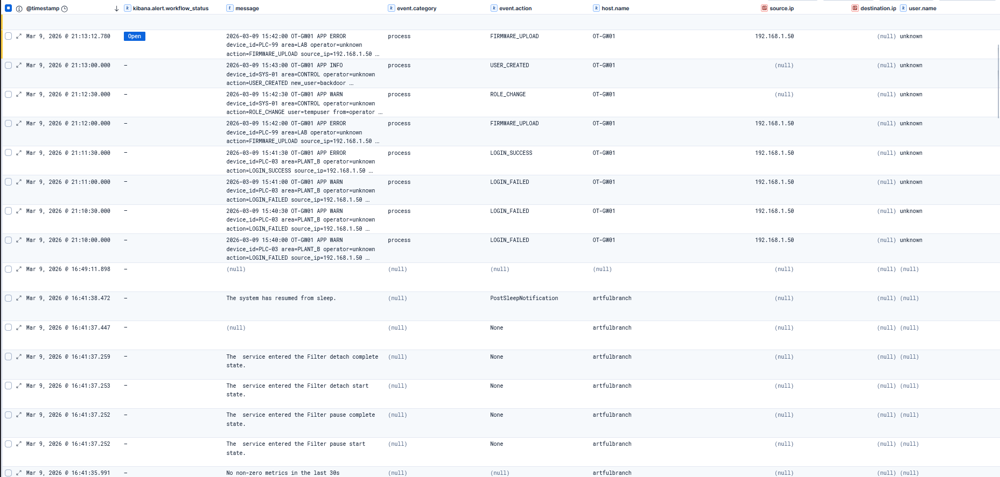
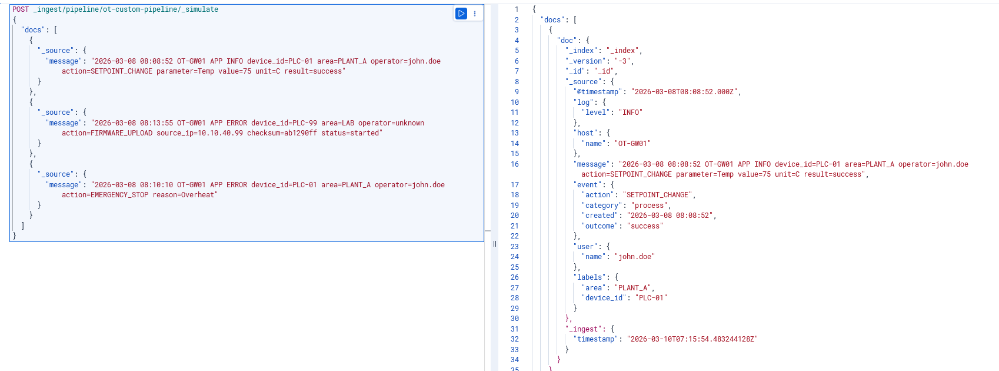
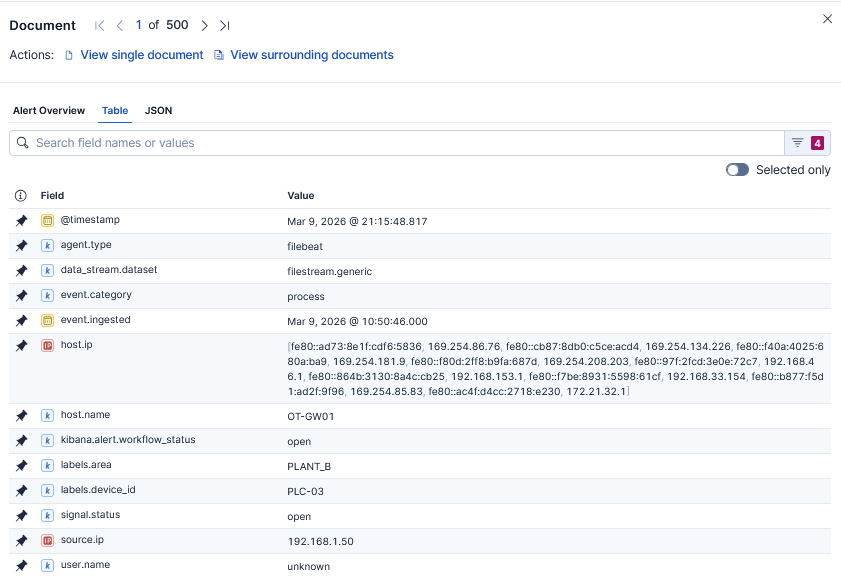
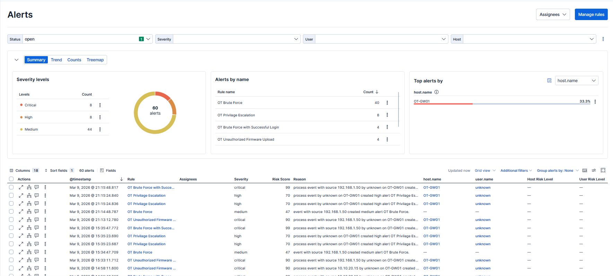
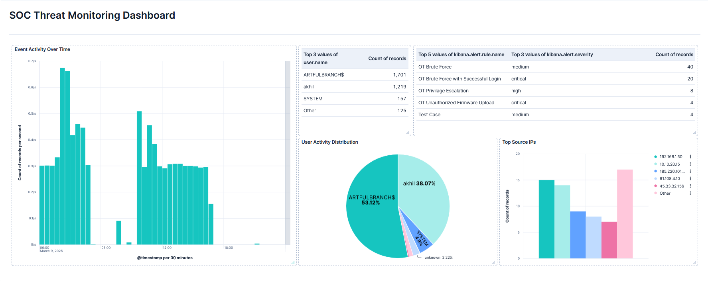
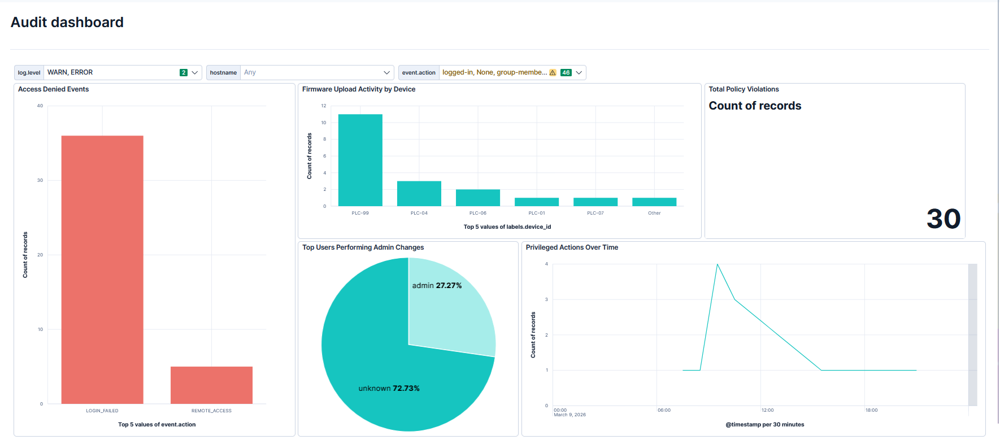

# Mini-SOC — OT Threat Detection Platform

> Full SIEM deployment on Elastic Cloud for OT/industrial threat detection. Custom ingest pipeline parsing variable-structure OT logs into ECS fields, four production-style detection rules in EQL and KQL (brute force, credential sequencing, firmware tampering, privilege escalation), and two Kibana dashboards for SOC monitoring and compliance auditing. Built and tested end-to-end — including debugging a UTC/IST timezone gap that was silently dropping alerts.

**Stack:** Elastic Cloud v9.3.1 · Elastic Agent · Fleet · Kibana · EQL · KQL · Grok · GCP (Mumbai)

---

## Architecture

```
[ARTFULBRANCH — Windows Host]
        |                    |
 Windows Security       ot_logs.log
 (System integration)   (Filestream integration)
        |                    |
        +----[Elastic Agent]--+
                  |
         [ot-custom-pipeline]
                  |
        [Elastic Cloud — Mumbai]
        Kibana: Discover / Rules / Dashboards
```

**Two live log sources ingested via Fleet-managed Elastic Agent:**

| Source | Integration | Index |
|---|---|---|
| Windows Security Events | System (Elastic Agent) | `logs-system.security-default` |
| OT App Logs (OT-GW01) | Custom Logs (Filestream) | `logs-filestream.generic-default` |

Simulates an industrial gateway (OT-GW01) across 7 devices and 5 plant areas.



---

## Ingest Pipeline — `ot-custom-pipeline`

### Why Grok over Dissect

OT log lines have **optional fields** — `source_ip` only appears on login/remote-access events, `reason` only on failures. Dissect requires every field in a fixed position. Grok handles missing fields gracefully via `ignore_failure`, making it the right fit for variable-structure logs.

### Example Log Line
```
2026-03-09 02:01:30 OT-GW01 APP WARN device_id=PLC-03 area=PLANT_B operator=unknown action=LOGIN_FAILED source_ip=203.0.113.10 result=failure
```

### Parsed ECS Output
```json
{
  "@timestamp": "2026-03-08T20:31:30.000Z",
  "host.name": "OT-GW01",
  "log.level": "WARN",
  "labels.device_id": "PLC-03",
  "labels.area": "PLANT_B",
  "user.name": "unknown",
  "event.action": "LOGIN_FAILED",
  "event.outcome": "failure",
  "event.category": "process",
  "source.ip": "203.0.113.10"
}
```

Seven processors: five grok (field extraction), one date (timestamp normalisation), one set (ECS field population).




---

## Detection Rules

Four rules covering the core OT threat use cases. All tested by injecting matching log lines and running rules manually.

| Rule | Type | Severity | Alerts Fired |
|---|---|---|---|
| OT Brute Force | Threshold | Medium | 40 |
| OT Brute Force + Success | EQL Sequence | Critical | 4 |
| OT Unauthorized Firmware Upload | Custom Query | Critical | 4 |
| OT Privilege Escalation | Custom Query | High | 8 |

### Rule Queries

**Brute Force (Threshold)**
```
event.action : "LOGIN_FAILED"
Group by: source.ip | >= 2 in 5 minutes
```

**Brute Force + Success (EQL Sequence)**
```eql
sequence by source.ip with maxspan=5m
  [LOGIN_FAILED] with runs=3
  [LOGIN_SUCCESS]
```

**Unauthorized Firmware Upload (KQL)**
```kql
event.action : "FIRMWARE_UPLOAD" and user.name : "unknown"
```

**Privilege Escalation (KQL)**
```kql
event.action : "ROLE_CHANGE" or event.action : "USER_CREATED"
```

Rule definitions in [`/rules`](rules/).



---

## Dashboards

### Dashboard 1 — SOC Threat Monitoring



| Panel | Type | Investigation Value |
|---|---|---|
| Event Activity Over Time | Bar chart | Spikes at 02:00 and 09:00 UTC reveal automated off-hours attacks |
| Top Alerted Users | Table | `unknown` presence flags unauthenticated OT access attempts |
| Active Alerts by Rule | Table (`.alerts-*`) | All firing rules with severity at a glance — analyst starting point |
| User Activity Distribution | Pie chart | `unknown` at 2.22% — small percentage, critical risk |
| Top Source IPs | Bar chart | `192.168.1.50` and `10.10.20.15` flagged as primary attackers |

### Dashboard 2 — OT Compliance & Audit



| Panel | Type | Finding |
|---|---|---|
| Access Denied Events | Bar chart | LOGIN_FAILED at 36 vs REMOTE_ACCESS at 5 — brute force confirmed as primary vector |
| Firmware Upload by Device | Bar chart | PLC-99 targeted 11 times — coordinated firmware tampering campaign |
| Total Policy Violations | Metric | 30 violations at a glance for compliance reporting |
| Top Users — Admin Changes | Pie chart | `unknown` at 72.73% of privilege escalation — critical audit finding |
| Privileged Actions Over Time | Line chart | Spike at 09:00 UTC — concentrated, targeted escalation activity |

**Interactive filters:** `log.level` · `host.name` · `event.action` — all affect panels simultaneously at dashboard level.

---

## Lessons Learned

These are the real problems hit during the build.

### 1. Filestream Cursor Tracking
Once a file is read, appending new lines doesn't always trigger re-ingestion. Renaming the file (`app.log` → `ot_logs.log`) was required to force a fresh read. In production: use log rotation or a dedicated log shipper that tracks inode changes.

### 2. UTC/IST Timezone Gap — Silent Alert Drops
The date processor converts local timestamps to UTC. Log lines written in IST (+5:30) land 5.5 hours later in Elasticsearch. Detection rules with short look-back windows were silently missing events — they fired on the right logs but the timestamps put those logs outside the window. Fixed by adjusting test injection strategy to account for the UTC offset. **This is a real production pitfall in any multi-timezone SOC environment.**

### 3. `event.created` Field Conflict
`event.created` conflicted with a built-in Elasticsearch mapping, causing values to appear in `_ignored`. Fixed by routing through `event.ingested` as intermediate and writing the final value to `@timestamp` via the date processor.

### 4. Threshold vs EQL Noise Difference
The threshold rule (Rule 1) fired 40 times on historical data because the look-back window covered all previously ingested events. The EQL sequence rule (Rule 2) fired 4 times for the same attack scenario — confirming EQL is significantly more precise for sequence-based detection. **Use EQL when the attack has a clear event order. Use threshold rules for volume-based anomalies.**

### 5. `labels.device_id` Dot-Notation in Dashboards
Using `labels.device_id` instead of a top-level field meant dashboard filters required the full dot-notation path. Worth standardising field naming conventions before building dashboards in production.

---

## Repository Structure

```
mini-soc-ot-detection/
├── README.md
├── pipelines/
│   └── ot-custom-pipeline.json     # Full ingest pipeline config
├── rules/
│   ├── brute_force.ndjson
│   ├── credential_sequence.ndjson
│   ├── firmware_upload.ndjson
│   └── privilege_escalation.ndjson
├── dashboards/
│   ├── soc-threat-monitoring.ndjson
│   └── ot-compliance-audit.ndjson
└── screenshots/
    ├── image1.png  — Log sources in Discover
    ├── image2.png  — Pipeline simulate output
    ├── image3.png  — Live ECS fields in Discover
    ├── image4.png  — All 4 rules firing
    ├── image5.png  — SOC Threat Monitoring dashboard
    ├── image6.png  — OT Compliance & Audit dashboard
    ├── image7.png  — Fleet Agent policy
    ├── image8.png  — Detection rules list
    └── image9.png  — Ingest pipeline JSON in Dev Tools
```

---

## What's Next

- Add sigma rule translations for the four detection use cases
- Extend to a third log source (network flow data)
- Build an automated alert-to-ticket workflow using Elastic's webhook action
- Tune threshold rule look-back to reduce historical noise in production deployments
